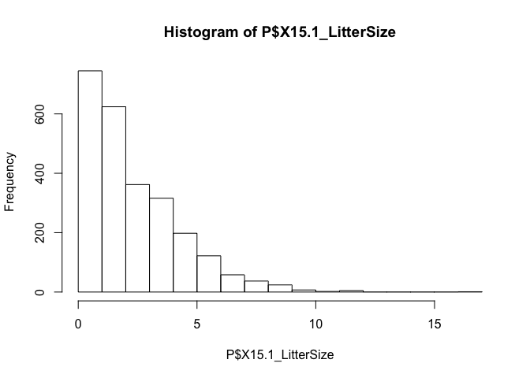
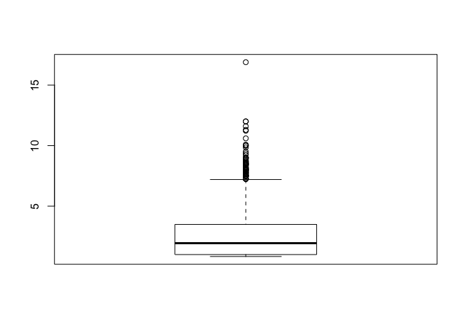
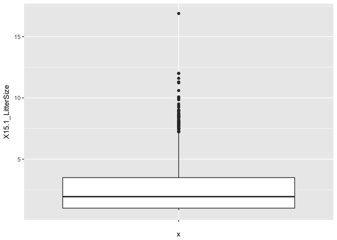

REU\_R\_2018\_workshop\_2
================
Ilya
6/20/2018

##### packages

``` r
#specify the repository (repos) to avoid error about mirror not being set
#also add logical so packages are only installed if they are missing 
#https://stackoverflow.com/questions/33969024/install-packages-fails-in-knitr-document-trying-to-use-cran-without-setting-a
if(!require(ggplot2)) install.packages("ggplot2",repos = "http://cran.us.r-project.org")
```

    ## Loading required package: ggplot2

``` r
if(!require(dplyr)) install.packages("dplyr",repos = "http://cran.us.r-project.org")
```

    ## Loading required package: dplyr

    ## 
    ## Attaching package: 'dplyr'

    ## The following objects are masked from 'package:stats':
    ## 
    ##     filter, lag

    ## The following objects are masked from 'package:base':
    ## 
    ##     intersect, setdiff, setequal, union

``` r
if(!require(data.table)) install.packages("data.table",repos = "http://cran.us.r-project.org")
```

    ## Loading required package: data.table

    ## 
    ## Attaching package: 'data.table'

    ## The following objects are masked from 'package:dplyr':
    ## 
    ##     between, first, last

``` r
#load package so you can use it here
library(dplyr)
library(ggplot2)
library(data.table)
```

##### set working directory -- note you'll need to change the working directory to your own computer

``` r
setwd("~/ilya documents/R/REU/workshops 2018/workshop_2/REU_R_2018_workshop_2")
```

##### read in PanTHERIA data (source: <http://esapubs.org/archive/ecol/e090/184/#data>) and inspect first few and last few lines

``` r
#open txt file in excel, save as csv 
P <- read.csv("PanTHERIA_1-0_WR05_Aug2008.csv", header=TRUE)

#view first few lines
head(P)
```

    ##    MSW05_Order MSW05_Family MSW05_Genus MSW05_Species      MSW05_Binomial
    ## 1 Artiodactyla    Camelidae     Camelus   dromedarius Camelus dromedarius
    ## 2    Carnivora      Canidae       Canis       adustus       Canis adustus
    ## 3    Carnivora      Canidae       Canis        aureus        Canis aureus
    ## 4    Carnivora      Canidae       Canis       latrans       Canis latrans
    ## 5    Carnivora      Canidae       Canis         lupus         Canis lupus
    ## 6 Artiodactyla      Bovidae         Bos     frontalis       Bos frontalis
    ##   X1.1_ActivityCycle X5.1_AdultBodyMass_g X8.1_AdultForearmLen_mm
    ## 1                  3            492714.47                    -999
    ## 2                  1             10392.49                    -999
    ## 3                  2              9658.70                    -999
    ## 4                  2             11989.10                    -999
    ## 5                  2             31756.51                    -999
    ## 6                  2            800143.05                    -999
    ##   X13.1_AdultHeadBodyLen_mm X2.1_AgeatEyeOpening_d X3.1_AgeatFirstBirth_d
    ## 1                   -999.00                -999.00                1651.62
    ## 2                    745.32                -999.00                -999.00
    ## 3                    827.53                   7.50                -999.00
    ## 4                    872.39                  11.94                 365.00
    ## 5                   1055.00                  14.01                 547.50
    ## 6                   2700.00                -999.00                -999.00
    ##   X18.1_BasalMetRate_mLO2hr X5.2_BasalMetRateMass_g X6.1_DietBreadth
    ## 1                   40293.0                  407000                3
    ## 2                    -999.0                    -999                6
    ## 3                    -999.0                    -999                6
    ## 4                    3699.0                   10450                1
    ## 5                   11254.2                   33100                1
    ## 6                    -999.0                    -999                3
    ##   X7.1_DispersalAge_d X9.1_GestationLen_d X12.1_HabitatBreadth
    ## 1             -999.00              386.51                    1
    ## 2              329.99               65.00                    1
    ## 3             -999.00               61.24                    1
    ## 4              255.00               61.74                    1
    ## 5              180.00               63.50                    1
    ## 6             -999.00              273.75                 -999
    ##   X22.1_HomeRange_km2 X22.2_HomeRange_Indiv_km2 X14.1_InterbirthInterval_d
    ## 1              196.32                   -999.00                     614.41
    ## 2                1.01                      1.01                    -999.00
    ## 3                2.95                      3.13                     365.00
    ## 4               18.88                     19.91                     365.00
    ## 5              159.86                     43.13                     365.00
    ## 6             -999.00                   -999.00                     403.02
    ##   X15.1_LitterSize X16.1_LittersPerYear X17.1_MaxLongevity_m
    ## 1             0.98                    1                480.0
    ## 2             4.50                 -999                137.0
    ## 3             3.74                 -999                192.0
    ## 4             5.72                 -999                262.0
    ## 5             4.98                    2                354.0
    ## 6             1.22                    1                314.4
    ##   X5.3_NeonateBodyMass_g X13.2_NeonateHeadBodyLen_mm
    ## 1               36751.19                        -999
    ## 2                -999.00                        -999
    ## 3                 211.82                        -999
    ## 4                 200.01                        -999
    ## 5                 412.31                        -999
    ## 6               22977.05                        -999
    ##   X21.1_PopulationDensity_n.km2 X10.1_PopulationGrpSize
    ## 1                          0.98                      11
    ## 2                          0.74                    -999
    ## 3                          0.22                    -999
    ## 4                          0.25                    -999
    ## 5                          0.01                    -999
    ## 6                          0.54                    -999
    ##   X23.1_SexualMaturityAge_d X10.2_SocialGrpSize X24.1_TeatNumber
    ## 1                   1947.94                  10             -999
    ## 2                    249.88                -999                8
    ## 3                    371.23                -999                8
    ## 4                    372.90                -999                8
    ## 5                    679.37                -999                9
    ## 6                    610.97                  40             -999
    ##   X12.2_Terrestriality X6.2_TrophicLevel X25.1_WeaningAge_d
    ## 1                    1                 1             389.38
    ## 2                    1                 2              52.89
    ## 3                    1                 2              61.30
    ## 4                    1                 3              43.71
    ## 5                    1                 3              44.82
    ## 6                 -999                 1             186.67
    ##   X5.4_WeaningBodyMass_g X13.3_WeaningHeadBodyLen_mm
    ## 1                   -999                        -999
    ## 2                   -999                        -999
    ## 3                   -999                        -999
    ## 4                   -999                        -999
    ## 5                   -999                        -999
    ## 6                   -999                        -999
    ##                                                References
    ## 1     511;543;719;1274;1297;1594;1654;1822;1848;2655;3044
    ## 2                         542;543;730;1113;1297;1573;2655
    ## 3                         543;679;730;1113;1297;1573;2655
    ## 4                367;542;543;730;1113;1297;1573;1822;2655
    ## 5 367;542;543;730;1015;1052;1113;1297;1573;1594;2338;2655
    ## 6                511;543;730;899;1297;1525;1848;2655;2986
    ##   X5.5_AdultBodyMass_g_EXT X16.2_LittersPerYear_EXT
    ## 1                     -999                   -999.0
    ## 2                     -999                   -999.0
    ## 3                     -999                      1.1
    ## 4                     -999                      1.1
    ## 5                     -999                   -999.0
    ## 6                     -999                   -999.0
    ##   X5.6_NeonateBodyMass_g_EXT X5.7_WeaningBodyMass_g_EXT X26.1_GR_Area_km2
    ## 1                       -999                       -999              -999
    ## 2                       -999                       -999          10581413
    ## 3                       -999                       -999          25739527
    ## 4                       -999                       -999          17099094
    ## 5                       -999                       -999          50803440
    ## 6                       -999                       -999           2294332
    ##   X26.2_GR_MaxLat_dd X26.3_GR_MinLat_dd X26.4_GR_MidRangeLat_dd
    ## 1            -999.00            -999.00                 -999.00
    ## 2              16.72             -28.73                   -6.00
    ## 3              47.00              -4.71                   21.14
    ## 4              71.39               8.02                   39.70
    ## 5              83.27              11.48                   47.38
    ## 6              28.01               2.86                   15.43
    ##   X26.5_GR_MaxLong_dd X26.6_GR_MinLong_dd X26.7_GR_MidRangeLong_dd
    ## 1             -999.00             -999.00                  -999.00
    ## 2               43.55              -17.53                    13.00
    ## 3              108.54              -17.05                    45.74
    ## 4              -67.07             -168.12                  -117.60
    ## 5              179.65             -171.84                     3.90
    ## 6              108.68               73.55                    91.12
    ##   X27.1_HuPopDen_Min_n.km2 X27.2_HuPopDen_Mean_n.km2
    ## 1                     -999                   -999.00
    ## 2                        0                     35.20
    ## 3                        0                     79.29
    ## 4                        0                     27.27
    ## 5                        0                     37.87
    ## 6                        1                    152.67
    ##   X27.3_HuPopDen_5p_n.km2 X27.4_HuPopDen_Change X28.1_Precip_Mean_mm
    ## 1                    -999               -999.00              -999.00
    ## 2                       1                  0.14                90.75
    ## 3                       0                  0.10                44.61
    ## 4                       0                  0.06                53.03
    ## 5                       0                  0.04                34.79
    ## 6                       8                  0.09               145.21
    ##   X28.2_Temp_Mean_01degC X30.1_AET_Mean_mm X30.2_PET_Mean_mm
    ## 1                -999.00           -999.00           -999.00
    ## 2                 236.51            922.90           1534.40
    ## 3                 217.23            438.02           1358.98
    ## 4                  58.18            503.02            728.37
    ## 5                   4.82            313.33            561.11
    ## 6                 229.71           1053.45           1483.02

``` r
#view last few lines
tail(P)
```

    ##      MSW05_Order MSW05_Family MSW05_Genus MSW05_Species
    ## 5411    Rodentia    Geomyidae  Zygogeomys     trichopus
    ## 5412    Rodentia      Muridae     Zyzomys       argurus
    ## 5413    Rodentia      Muridae     Zyzomys         maini
    ## 5414    Rodentia      Muridae     Zyzomys     palatilis
    ## 5415    Rodentia      Muridae     Zyzomys  pedunculatus
    ## 5416    Rodentia      Muridae     Zyzomys     woodwardi
    ##            MSW05_Binomial X1.1_ActivityCycle X5.1_AdultBodyMass_g
    ## 5411 Zygogeomys trichopus               -999               473.54
    ## 5412      Zyzomys argurus               -999                40.42
    ## 5413        Zyzomys maini               -999                93.99
    ## 5414    Zyzomys palatilis               -999               123.00
    ## 5415 Zyzomys pedunculatus               -999               100.00
    ## 5416    Zyzomys woodwardi               -999                95.02
    ##      X8.1_AdultForearmLen_mm X13.1_AdultHeadBodyLen_mm
    ## 5411                    -999                    225.00
    ## 5412                    -999                    107.83
    ## 5413                    -999                   -999.00
    ## 5414                    -999                   -999.00
    ## 5415                    -999                    126.79
    ## 5416                    -999                    146.07
    ##      X2.1_AgeatEyeOpening_d X3.1_AgeatFirstBirth_d
    ## 5411                   -999                   -999
    ## 5412                   -999                   -999
    ## 5413                   -999                   -999
    ## 5414                   -999                   -999
    ## 5415                   -999                   -999
    ## 5416                   -999                   -999
    ##      X18.1_BasalMetRate_mLO2hr X5.2_BasalMetRateMass_g X6.1_DietBreadth
    ## 5411                      -999                    -999                4
    ## 5412                      -999                    -999             -999
    ## 5413                      -999                    -999             -999
    ## 5414                      -999                    -999             -999
    ## 5415                      -999                    -999             -999
    ## 5416                      -999                    -999             -999
    ##      X7.1_DispersalAge_d X9.1_GestationLen_d X12.1_HabitatBreadth
    ## 5411                -999                -999                    2
    ## 5412                -999                  25                 -999
    ## 5413                -999                -999                 -999
    ## 5414                -999                -999                 -999
    ## 5415                -999                -999                 -999
    ## 5416                -999                -999                 -999
    ##      X22.1_HomeRange_km2 X22.2_HomeRange_Indiv_km2
    ## 5411           -9.99e+02                 -9.99e+02
    ## 5412            1.04e-03                  9.56e-04
    ## 5413           -9.99e+02                 -9.99e+02
    ## 5414           -9.99e+02                 -9.99e+02
    ## 5415           -9.99e+02                 -9.99e+02
    ## 5416           -9.99e+02                 -9.99e+02
    ##      X14.1_InterbirthInterval_d X15.1_LitterSize X16.1_LittersPerYear
    ## 5411                    -999.00          -999.00                 -999
    ## 5412                     219.00             2.76                 -999
    ## 5413                    -999.00          -999.00                 -999
    ## 5414                    -999.00          -999.00                 -999
    ## 5415                    -999.00          -999.00                 -999
    ## 5416                     231.16             2.23                 -999
    ##      X17.1_MaxLongevity_m X5.3_NeonateBodyMass_g
    ## 5411                 -999                   -999
    ## 5412                 -999                   -999
    ## 5413                 -999                   -999
    ## 5414                 -999                   -999
    ## 5415                 -999                   -999
    ## 5416                 -999                   -999
    ##      X13.2_NeonateHeadBodyLen_mm X21.1_PopulationDensity_n.km2
    ## 5411                        -999                       -999.00
    ## 5412                        -999                        535.51
    ## 5413                        -999                       -999.00
    ## 5414                        -999                       -999.00
    ## 5415                        -999                       -999.00
    ## 5416                        -999                       -999.00
    ##      X10.1_PopulationGrpSize X23.1_SexualMaturityAge_d X10.2_SocialGrpSize
    ## 5411                    -999                   -999.00                -999
    ## 5412                    -999                    155.06                -999
    ## 5413                    -999                   -999.00                -999
    ## 5414                    -999                   -999.00                -999
    ## 5415                    -999                   -999.00                -999
    ## 5416                    -999                    155.06                -999
    ##      X24.1_TeatNumber X12.2_Terrestriality X6.2_TrophicLevel
    ## 5411             -999                    1                 1
    ## 5412                4                 -999              -999
    ## 5413             -999                 -999              -999
    ## 5414             -999                 -999              -999
    ## 5415                4                 -999              -999
    ## 5416                4                 -999              -999
    ##      X25.1_WeaningAge_d X5.4_WeaningBodyMass_g X13.3_WeaningHeadBodyLen_mm
    ## 5411            -999.00                   -999                     -999.00
    ## 5412              34.99                     14                       81.25
    ## 5413            -999.00                   -999                     -999.00
    ## 5414            -999.00                   -999                     -999.00
    ## 5415            -999.00                   -999                     -999.00
    ## 5416              34.99                   -999                     -999.00
    ##                          References X5.5_AdultBodyMass_g_EXT
    ## 5411                 1015;2151;2655                     -999
    ## 5412 435;456;525;730;1297;2655;2803                     -999
    ## 5413                           2655                     -999
    ## 5414                           2655                     -999
    ## 5415                      2655;2803                     -999
    ## 5416             525;1297;2655;2803                     -999
    ##      X16.2_LittersPerYear_EXT X5.6_NeonateBodyMass_g_EXT
    ## 5411                  -999.00                       -999
    ## 5412                     1.42                       -999
    ## 5413                  -999.00                       -999
    ## 5414                  -999.00                       -999
    ## 5415                  -999.00                       -999
    ## 5416                     1.38                       -999
    ##      X5.7_WeaningBodyMass_g_EXT X26.1_GR_Area_km2 X26.2_GR_MaxLat_dd
    ## 5411                       -999           1706.58              19.74
    ## 5412                       -999         886980.70             -11.11
    ## 5413                       -999          51093.30             -12.90
    ## 5414                       -999           4667.41             -17.45
    ## 5415                       -999         233915.99             -20.25
    ## 5416                       -999          70724.82             -13.73
    ##      X26.3_GR_MinLat_dd X26.4_GR_MidRangeLat_dd X26.5_GR_MaxLong_dd
    ## 5411              19.26                   19.50             -101.67
    ## 5412             -25.49                  -18.30              147.85
    ## 5413             -15.06                  -13.98              133.87
    ## 5414             -18.16                  -17.81              137.43
    ## 5415             -25.36                  -22.81              135.78
    ## 5416             -17.35                  -15.54              127.69
    ##      X26.6_GR_MinLong_dd X26.7_GR_MidRangeLong_dd X27.1_HuPopDen_Min_n.km2
    ## 5411             -102.41                  -102.04                       83
    ## 5412              114.33                   131.09                        0
    ## 5413              131.45                   132.66                        0
    ## 5414              136.72                   137.08                        0
    ## 5415              130.16                   132.97                        0
    ## 5416              123.42                   125.55                        0
    ##      X27.2_HuPopDen_Mean_n.km2 X27.3_HuPopDen_5p_n.km2
    ## 5411                    105.64                      83
    ## 5412                      1.10                       0
    ## 5413                      0.17                       0
    ## 5414                      0.00                       0
    ## 5415                      0.09                       0
    ## 5416                      0.00                       0
    ##      X27.4_HuPopDen_Change X28.1_Precip_Mean_mm X28.2_Temp_Mean_01degC
    ## 5411                  0.05                84.67                 176.37
    ## 5412                  0.02                62.33                 256.75
    ## 5413                  0.00                90.76                 265.30
    ## 5414               -999.00                49.00                 247.16
    ## 5415                  0.25                21.64                 215.72
    ## 5416               -999.00                79.45                 280.41
    ##      X30.1_AET_Mean_mm X30.2_PET_Mean_mm
    ## 5411            833.34           1362.00
    ## 5412            692.93           1704.98
    ## 5413            877.90           1755.73
    ## 5414            637.90           1638.67
    ## 5415            291.82           1405.85
    ## 5416            798.86           1765.19

##### alternative way of reading in data: this is a more reliable method than opening .txt file in excel and saving as csv (as above with read.csv), because some .txt files will be too big to open in excel. however, remembered about this method after powerpoint was done, and this method results in variables having slightly different names vs. method above, which would be confusing, so not using for this workshop.

``` r
#use fread from package data.table
P_alternate <- fread("PanTHERIA_1-0_WR05_Aug2008.txt")
```

##### get the dimensions of dataset-- should be 5416 row\*55 col

``` r
dim(P)
```

    ## [1] 5416   55

##### print list of column names of dataset

``` r
names(P)
```

    ##  [1] "MSW05_Order"                   "MSW05_Family"                 
    ##  [3] "MSW05_Genus"                   "MSW05_Species"                
    ##  [5] "MSW05_Binomial"                "X1.1_ActivityCycle"           
    ##  [7] "X5.1_AdultBodyMass_g"          "X8.1_AdultForearmLen_mm"      
    ##  [9] "X13.1_AdultHeadBodyLen_mm"     "X2.1_AgeatEyeOpening_d"       
    ## [11] "X3.1_AgeatFirstBirth_d"        "X18.1_BasalMetRate_mLO2hr"    
    ## [13] "X5.2_BasalMetRateMass_g"       "X6.1_DietBreadth"             
    ## [15] "X7.1_DispersalAge_d"           "X9.1_GestationLen_d"          
    ## [17] "X12.1_HabitatBreadth"          "X22.1_HomeRange_km2"          
    ## [19] "X22.2_HomeRange_Indiv_km2"     "X14.1_InterbirthInterval_d"   
    ## [21] "X15.1_LitterSize"              "X16.1_LittersPerYear"         
    ## [23] "X17.1_MaxLongevity_m"          "X5.3_NeonateBodyMass_g"       
    ## [25] "X13.2_NeonateHeadBodyLen_mm"   "X21.1_PopulationDensity_n.km2"
    ## [27] "X10.1_PopulationGrpSize"       "X23.1_SexualMaturityAge_d"    
    ## [29] "X10.2_SocialGrpSize"           "X24.1_TeatNumber"             
    ## [31] "X12.2_Terrestriality"          "X6.2_TrophicLevel"            
    ## [33] "X25.1_WeaningAge_d"            "X5.4_WeaningBodyMass_g"       
    ## [35] "X13.3_WeaningHeadBodyLen_mm"   "References"                   
    ## [37] "X5.5_AdultBodyMass_g_EXT"      "X16.2_LittersPerYear_EXT"     
    ## [39] "X5.6_NeonateBodyMass_g_EXT"    "X5.7_WeaningBodyMass_g_EXT"   
    ## [41] "X26.1_GR_Area_km2"             "X26.2_GR_MaxLat_dd"           
    ## [43] "X26.3_GR_MinLat_dd"            "X26.4_GR_MidRangeLat_dd"      
    ## [45] "X26.5_GR_MaxLong_dd"           "X26.6_GR_MinLong_dd"          
    ## [47] "X26.7_GR_MidRangeLong_dd"      "X27.1_HuPopDen_Min_n.km2"     
    ## [49] "X27.2_HuPopDen_Mean_n.km2"     "X27.3_HuPopDen_5p_n.km2"      
    ## [51] "X27.4_HuPopDen_Change"         "X28.1_Precip_Mean_mm"         
    ## [53] "X28.2_Temp_Mean_01degC"        "X30.1_AET_Mean_mm"            
    ## [55] "X30.2_PET_Mean_mm"

##### get a summary of your data

``` r
summary(P)
```

    ##        MSW05_Order             MSW05_Family        MSW05_Genus  
    ##  Rodentia    :2277   Muridae         : 730   Crocidura   : 172  
    ##  Chiroptera  :1116   Cricetidae      : 681   Myotis      : 103  
    ##  Soricomorpha: 428   Vespertilionidae: 407   Rhinolophus :  77  
    ##  Primates    : 376   Soricidae       : 376   Sorex       :  77  
    ##  Carnivora   : 286   Sciuridae       : 278   Hipposideros:  67  
    ##  Artiodactyla: 240   Pteropodidae    : 186   Rattus      :  66  
    ##  (Other)     : 693   (Other)         :2758   (Other)     :4854  
    ##    MSW05_Species               MSW05_Binomial X1.1_ActivityCycle
    ##  australis:  15   Abditomys latidens  :   1   Min.   :-999.0    
    ##  thomasi  :  15   Abeomelomys sevia   :   1   1st Qu.:-999.0    
    ##  macrotis :  14   Abrawayaomys ruschii:   1   Median :-999.0    
    ##  major    :  14   Abrocoma bennettii  :   1   Mean   :-692.4    
    ##  grandis  :  11   Abrocoma boliviensis:   1   3rd Qu.:   1.0    
    ##  minor    :  11   Abrocoma budini     :   1   Max.   :   3.0    
    ##  (Other)  :5336   (Other)             :5410                     
    ##  X5.1_AdultBodyMass_g X8.1_AdultForearmLen_mm X13.1_AdultHeadBodyLen_mm
    ##  Min.   :     -999    Min.   :-999.0          Min.   : -999.0          
    ##  1st Qu.:     -999    1st Qu.:-999.0          1st Qu.: -999.0          
    ##  Median :       23    Median :-999.0          Median : -999.0          
    ##  Mean   :   115940    Mean   :-823.3          Mean   : -441.4          
    ##  3rd Qu.:      282    3rd Qu.:-999.0          3rd Qu.:  131.0          
    ##  Max.   :154321304    Max.   : 246.0          Max.   :30480.0          
    ##                                                                        
    ##  X2.1_AgeatEyeOpening_d X3.1_AgeatFirstBirth_d X18.1_BasalMetRate_mLO2hr
    ##  Min.   :-999.0         Min.   :-999.0         Min.   :  -999.0         
    ##  1st Qu.:-999.0         1st Qu.:-999.0         1st Qu.:  -999.0         
    ##  Median :-999.0         Median :-999.0         Median :  -999.0         
    ##  Mean   :-909.9         Mean   :-848.9         Mean   :  -694.5         
    ##  3rd Qu.:-999.0         3rd Qu.:-999.0         3rd Qu.:  -999.0         
    ##  Max.   : 153.5         Max.   :5456.8         Max.   :113712.0         
    ##                                                                         
    ##  X5.2_BasalMetRateMass_g X6.1_DietBreadth X7.1_DispersalAge_d
    ##  Min.   :  -999.0        Min.   :-999.0   Min.   :-999.0     
    ##  1st Qu.:  -999.0        1st Qu.:-999.0   1st Qu.:-999.0     
    ##  Median :  -999.0        Median :-999.0   Median :-999.0     
    ##  Mean   :   -42.3        Mean   :-599.4   Mean   :-961.6     
    ##  3rd Qu.:  -999.0        3rd Qu.:   2.0   3rd Qu.:-999.0     
    ##  Max.   :407000.0        Max.   :   8.0   Max.   :5249.0     
    ##                                                              
    ##  X9.1_GestationLen_d X12.1_HabitatBreadth X22.1_HomeRange_km2
    ##  Min.   :-999.00     Min.   :-999.0       Min.   : -999      
    ##  1st Qu.:-999.00     1st Qu.:-999.0       1st Qu.: -999      
    ##  Median :-999.00     Median :   1.0       Median : -999      
    ##  Mean   :-719.85     Mean   :-495.9       Mean   : -838      
    ##  3rd Qu.:  12.06     3rd Qu.:   1.0       3rd Qu.: -999      
    ##  Max.   : 660.00     Max.   :   4.0       Max.   :79245      
    ##                                                              
    ##  X22.2_HomeRange_Indiv_km2 X14.1_InterbirthInterval_d X15.1_LitterSize  
    ##  Min.   :  -999.0          Min.   :-999.0             Min.   :-999.000  
    ##  1st Qu.:  -999.0          1st Qu.:-999.0             1st Qu.:-999.000  
    ##  Median :  -999.0          Median :-999.0             Median :-999.000  
    ##  Mean   :  -845.8          Mean   :-827.4             Mean   :-536.517  
    ##  3rd Qu.:  -999.0          3rd Qu.:-999.0             3rd Qu.:   1.683  
    ##  Max.   :112249.7          Max.   :2007.5             Max.   :  16.890  
    ##                                                                         
    ##  X16.1_LittersPerYear X17.1_MaxLongevity_m X5.3_NeonateBodyMass_g
    ##  Min.   :-999.0       Min.   :-999.0       Min.   :   -999       
    ##  1st Qu.:-999.0       1st Qu.:-999.0       1st Qu.:   -999       
    ##  Median :-999.0       Median :-999.0       Median :   -999       
    ##  Mean   :-833.8       Mean   :-775.4       Mean   :   1315       
    ##  3rd Qu.:-999.0       3rd Qu.:-999.0       3rd Qu.:   -999       
    ##  Max.   :  10.0       Max.   :1470.0       Max.   :2738613       
    ##                                                                  
    ##  X13.2_NeonateHeadBodyLen_mm X21.1_PopulationDensity_n.km2
    ##  Min.   :-999.0              Min.   : -999.0              
    ##  1st Qu.:-999.0              1st Qu.: -999.0              
    ##  Median :-999.0              Median : -999.0              
    ##  Mean   :-943.3              Mean   : -682.2              
    ##  3rd Qu.:-999.0              3rd Qu.: -999.0              
    ##  Max.   :7600.0              Max.   :57067.8              
    ##                                                           
    ##  X10.1_PopulationGrpSize X23.1_SexualMaturityAge_d X10.2_SocialGrpSize
    ##  Min.   :  -999.0        Min.   :-999.0            Min.   :-999.0     
    ##  1st Qu.:  -999.0        1st Qu.:-999.0            1st Qu.:-999.0     
    ##  Median :  -999.0        Median :-999.0            Median :-999.0     
    ##  Mean   :  -677.2        Mean   :-677.4            Mean   :-867.7     
    ##  3rd Qu.:  -999.0        3rd Qu.:-999.0            3rd Qu.:-999.0     
    ##  Max.   :500500.0        Max.   :6041.2            Max.   : 110.0     
    ##                                                                       
    ##  X24.1_TeatNumber X12.2_Terrestriality X6.2_TrophicLevel
    ##  Min.   :-999.0   Min.   :-999         Min.   :-999.0   
    ##  1st Qu.:-999.0   1st Qu.:-999         1st Qu.:-999.0   
    ##  Median :-999.0   Median :-999         Median :-999.0   
    ##  Mean   :-880.1   Mean   :-512         Mean   :-599.6   
    ##  3rd Qu.:-999.0   3rd Qu.:   2         3rd Qu.:   2.0   
    ##  Max.   :  26.0   Max.   :   2         Max.   :   3.0   
    ##                                                         
    ##  X25.1_WeaningAge_d X5.4_WeaningBodyMass_g X13.3_WeaningHeadBodyLen_mm
    ##  Min.   :-999.0     Min.   :    -999       Min.   : -999.0            
    ##  1st Qu.:-999.0     1st Qu.:    -999       1st Qu.: -999.0            
    ##  Median :-999.0     Median :    -999       Median : -999.0            
    ##  Mean   :-758.8     Mean   :    4010       Mean   : -982.1            
    ##  3rd Qu.:-999.0     3rd Qu.:    -999       3rd Qu.: -999.0            
    ##  Max.   :1260.8     Max.   :17000000       Max.   :12000.0            
    ##                                                                       
    ##      References   X5.5_AdultBodyMass_g_EXT X16.2_LittersPerYear_EXT
    ##  -999     :1250   Min.   :   -999          Min.   :-999.00         
    ##  2655     : 268   1st Qu.:   -999          1st Qu.:-999.00         
    ##  1658;2151: 127   Median :   -999          Median :-999.00         
    ##  2151;2655:  83   Mean   :   -661          Mean   :-926.22         
    ##  1297;2655:  80   3rd Qu.:   -999          3rd Qu.:-999.00         
    ##  1297     :  78   Max.   :1061721          Max.   :   5.19         
    ##  (Other)  :3530                                                    
    ##  X5.6_NeonateBodyMass_g_EXT X5.7_WeaningBodyMass_g_EXT X26.1_GR_Area_km2 
    ##  Min.   :   -999.0          Min.   :   -999            Min.   :    -999  
    ##  1st Qu.:   -999.0          1st Qu.:   -999            1st Qu.:    5841  
    ##  Median :   -999.0          Median :   -999            Median :  136931  
    ##  Mean   :   -175.1          Mean   :    618            Mean   : 1431990  
    ##  3rd Qu.:   -999.0          3rd Qu.:   -999            3rd Qu.: 1058628  
    ##  Max.   :2458093.7          Max.   :6395530            Max.   :63034304  
    ##                                                                          
    ##  X26.2_GR_MaxLat_dd X26.3_GR_MinLat_dd X26.4_GR_MidRangeLat_dd
    ##  Min.   :-999.00    Min.   :-999.00    Min.   :-999.000       
    ##  1st Qu.: -13.40    1st Qu.: -27.86    1st Qu.: -18.580       
    ##  Median :   6.75    Median :  -5.94    Median :  -0.475       
    ##  Mean   :-127.02    Mean   :-138.26    Mean   :-132.638       
    ##  3rd Qu.:  24.60    3rd Qu.:  12.42    3rd Qu.:  17.645       
    ##  Max.   :  83.62    Max.   :  70.78    Max.   :  71.680       
    ##                                                               
    ##  X26.5_GR_MaxLong_dd X26.6_GR_MinLong_dd X26.7_GR_MidRangeLong_dd
    ##  Min.   :-999.00     Min.   :-999.000    Min.   :-999.00         
    ##  1st Qu.: -74.13     1st Qu.: -93.272    1st Qu.: -79.33         
    ##  Median :  31.30     Median :   3.055    Median :  16.93         
    ##  Mean   :-107.41     Mean   :-124.979    Mean   :-116.20         
    ##  3rd Qu.: 108.62     3rd Qu.:  89.640    3rd Qu.:  99.43         
    ##  Max.   : 180.00     Max.   : 172.340    Max.   : 175.75         
    ##                                                                  
    ##  X27.1_HuPopDen_Min_n.km2 X27.2_HuPopDen_Mean_n.km2
    ##  Min.   :-999.0           Min.   :-999.00          
    ##  1st Qu.:   0.0           1st Qu.:   6.00          
    ##  Median :   1.0           Median :  28.85          
    ##  Mean   :-124.7           Mean   : -69.94          
    ##  3rd Qu.:   5.0           3rd Qu.:  75.60          
    ##  Max.   :1119.0           Max.   :2060.50          
    ##                                                    
    ##  X27.3_HuPopDen_5p_n.km2 X27.4_HuPopDen_Change X28.1_Precip_Mean_mm
    ##  Min.   :-999.000        Min.   :-999.00       Min.   :-999.00     
    ##  1st Qu.:   0.000        1st Qu.:   0.03       1st Qu.:  29.83     
    ##  Median :   2.000        Median :   0.09       Median :  91.06     
    ##  Mean   :-122.374        Mean   :-145.82       Mean   : -61.84     
    ##  3rd Qu.:   8.125        3rd Qu.:   0.12       3rd Qu.: 154.61     
    ##  Max.   :1119.000        Max.   :   1.00       Max.   : 461.00     
    ##                                                                    
    ##  X28.2_Temp_Mean_01degC X30.1_AET_Mean_mm X30.2_PET_Mean_mm
    ##  Min.   :-999.000       Min.   :-999.0    Min.   :-999.0   
    ##  1st Qu.:  68.150       1st Qu.: 269.3    1st Qu.: 639.6   
    ##  Median : 199.655       Median : 843.7    Median :1379.1   
    ##  Mean   :  -6.575       Mean   : 580.2    Mean   : 885.4   
    ##  3rd Qu.: 239.215       3rd Qu.:1276.7    3rd Qu.:1577.0   
    ##  Max.   : 350.000       Max.   :1858.6    Max.   :2107.0   
    ## 

#### summarize single column

``` r
# use the $ operator to access a single column
summary(P$X5.1_AdultBodyMass_g)
```

    ##      Min.   1st Qu.    Median      Mean   3rd Qu.      Max. 
    ##      -999      -999        23    115940       282 154321304

``` r
#notice there are -999 values; need to change to NA
```

##### change -999 to NA in single column using function "which"

``` r
#see what == does
TRUE==TRUE
```

    ## [1] TRUE

``` r
1==2
```

    ## [1] FALSE

``` r
#see what != does
TRUE!=FALSE
```

    ## [1] TRUE

``` r
1!=1
```

    ## [1] FALSE

``` r
#find -999 rows
row_indices = which(P$X5.1_AdultBodyMass_g==-999)
#change values to NA
P$X5.1_AdultBodyMass_g[row_indices]=NA
#get summary again
summary(P$X5.1_AdultBodyMass_g)
```

    ##      Min.   1st Qu.    Median      Mean   3rd Qu.      Max.      NA's 
    ##         2        25       104    177810      1407 154321304      1874

##### change -999 to NA in all columns using function replace

``` r
#check that there are -999 in various cols
summary(P)
```

    ##        MSW05_Order             MSW05_Family        MSW05_Genus  
    ##  Rodentia    :2277   Muridae         : 730   Crocidura   : 172  
    ##  Chiroptera  :1116   Cricetidae      : 681   Myotis      : 103  
    ##  Soricomorpha: 428   Vespertilionidae: 407   Rhinolophus :  77  
    ##  Primates    : 376   Soricidae       : 376   Sorex       :  77  
    ##  Carnivora   : 286   Sciuridae       : 278   Hipposideros:  67  
    ##  Artiodactyla: 240   Pteropodidae    : 186   Rattus      :  66  
    ##  (Other)     : 693   (Other)         :2758   (Other)     :4854  
    ##    MSW05_Species               MSW05_Binomial X1.1_ActivityCycle
    ##  australis:  15   Abditomys latidens  :   1   Min.   :-999.0    
    ##  thomasi  :  15   Abeomelomys sevia   :   1   1st Qu.:-999.0    
    ##  macrotis :  14   Abrawayaomys ruschii:   1   Median :-999.0    
    ##  major    :  14   Abrocoma bennettii  :   1   Mean   :-692.4    
    ##  grandis  :  11   Abrocoma boliviensis:   1   3rd Qu.:   1.0    
    ##  minor    :  11   Abrocoma budini     :   1   Max.   :   3.0    
    ##  (Other)  :5336   (Other)             :5410                     
    ##  X5.1_AdultBodyMass_g X8.1_AdultForearmLen_mm X13.1_AdultHeadBodyLen_mm
    ##  Min.   :        2    Min.   :-999.0          Min.   : -999.0          
    ##  1st Qu.:       25    1st Qu.:-999.0          1st Qu.: -999.0          
    ##  Median :      104    Median :-999.0          Median : -999.0          
    ##  Mean   :   177810    Mean   :-823.3          Mean   : -441.4          
    ##  3rd Qu.:     1407    3rd Qu.:-999.0          3rd Qu.:  131.0          
    ##  Max.   :154321304    Max.   : 246.0          Max.   :30480.0          
    ##  NA's   :1874                                                          
    ##  X2.1_AgeatEyeOpening_d X3.1_AgeatFirstBirth_d X18.1_BasalMetRate_mLO2hr
    ##  Min.   :-999.0         Min.   :-999.0         Min.   :  -999.0         
    ##  1st Qu.:-999.0         1st Qu.:-999.0         1st Qu.:  -999.0         
    ##  Median :-999.0         Median :-999.0         Median :  -999.0         
    ##  Mean   :-909.9         Mean   :-848.9         Mean   :  -694.5         
    ##  3rd Qu.:-999.0         3rd Qu.:-999.0         3rd Qu.:  -999.0         
    ##  Max.   : 153.5         Max.   :5456.8         Max.   :113712.0         
    ##                                                                         
    ##  X5.2_BasalMetRateMass_g X6.1_DietBreadth X7.1_DispersalAge_d
    ##  Min.   :  -999.0        Min.   :-999.0   Min.   :-999.0     
    ##  1st Qu.:  -999.0        1st Qu.:-999.0   1st Qu.:-999.0     
    ##  Median :  -999.0        Median :-999.0   Median :-999.0     
    ##  Mean   :   -42.3        Mean   :-599.4   Mean   :-961.6     
    ##  3rd Qu.:  -999.0        3rd Qu.:   2.0   3rd Qu.:-999.0     
    ##  Max.   :407000.0        Max.   :   8.0   Max.   :5249.0     
    ##                                                              
    ##  X9.1_GestationLen_d X12.1_HabitatBreadth X22.1_HomeRange_km2
    ##  Min.   :-999.00     Min.   :-999.0       Min.   : -999      
    ##  1st Qu.:-999.00     1st Qu.:-999.0       1st Qu.: -999      
    ##  Median :-999.00     Median :   1.0       Median : -999      
    ##  Mean   :-719.85     Mean   :-495.9       Mean   : -838      
    ##  3rd Qu.:  12.06     3rd Qu.:   1.0       3rd Qu.: -999      
    ##  Max.   : 660.00     Max.   :   4.0       Max.   :79245      
    ##                                                              
    ##  X22.2_HomeRange_Indiv_km2 X14.1_InterbirthInterval_d X15.1_LitterSize  
    ##  Min.   :  -999.0          Min.   :-999.0             Min.   :-999.000  
    ##  1st Qu.:  -999.0          1st Qu.:-999.0             1st Qu.:-999.000  
    ##  Median :  -999.0          Median :-999.0             Median :-999.000  
    ##  Mean   :  -845.8          Mean   :-827.4             Mean   :-536.517  
    ##  3rd Qu.:  -999.0          3rd Qu.:-999.0             3rd Qu.:   1.683  
    ##  Max.   :112249.7          Max.   :2007.5             Max.   :  16.890  
    ##                                                                         
    ##  X16.1_LittersPerYear X17.1_MaxLongevity_m X5.3_NeonateBodyMass_g
    ##  Min.   :-999.0       Min.   :-999.0       Min.   :   -999       
    ##  1st Qu.:-999.0       1st Qu.:-999.0       1st Qu.:   -999       
    ##  Median :-999.0       Median :-999.0       Median :   -999       
    ##  Mean   :-833.8       Mean   :-775.4       Mean   :   1315       
    ##  3rd Qu.:-999.0       3rd Qu.:-999.0       3rd Qu.:   -999       
    ##  Max.   :  10.0       Max.   :1470.0       Max.   :2738613       
    ##                                                                  
    ##  X13.2_NeonateHeadBodyLen_mm X21.1_PopulationDensity_n.km2
    ##  Min.   :-999.0              Min.   : -999.0              
    ##  1st Qu.:-999.0              1st Qu.: -999.0              
    ##  Median :-999.0              Median : -999.0              
    ##  Mean   :-943.3              Mean   : -682.2              
    ##  3rd Qu.:-999.0              3rd Qu.: -999.0              
    ##  Max.   :7600.0              Max.   :57067.8              
    ##                                                           
    ##  X10.1_PopulationGrpSize X23.1_SexualMaturityAge_d X10.2_SocialGrpSize
    ##  Min.   :  -999.0        Min.   :-999.0            Min.   :-999.0     
    ##  1st Qu.:  -999.0        1st Qu.:-999.0            1st Qu.:-999.0     
    ##  Median :  -999.0        Median :-999.0            Median :-999.0     
    ##  Mean   :  -677.2        Mean   :-677.4            Mean   :-867.7     
    ##  3rd Qu.:  -999.0        3rd Qu.:-999.0            3rd Qu.:-999.0     
    ##  Max.   :500500.0        Max.   :6041.2            Max.   : 110.0     
    ##                                                                       
    ##  X24.1_TeatNumber X12.2_Terrestriality X6.2_TrophicLevel
    ##  Min.   :-999.0   Min.   :-999         Min.   :-999.0   
    ##  1st Qu.:-999.0   1st Qu.:-999         1st Qu.:-999.0   
    ##  Median :-999.0   Median :-999         Median :-999.0   
    ##  Mean   :-880.1   Mean   :-512         Mean   :-599.6   
    ##  3rd Qu.:-999.0   3rd Qu.:   2         3rd Qu.:   2.0   
    ##  Max.   :  26.0   Max.   :   2         Max.   :   3.0   
    ##                                                         
    ##  X25.1_WeaningAge_d X5.4_WeaningBodyMass_g X13.3_WeaningHeadBodyLen_mm
    ##  Min.   :-999.0     Min.   :    -999       Min.   : -999.0            
    ##  1st Qu.:-999.0     1st Qu.:    -999       1st Qu.: -999.0            
    ##  Median :-999.0     Median :    -999       Median : -999.0            
    ##  Mean   :-758.8     Mean   :    4010       Mean   : -982.1            
    ##  3rd Qu.:-999.0     3rd Qu.:    -999       3rd Qu.: -999.0            
    ##  Max.   :1260.8     Max.   :17000000       Max.   :12000.0            
    ##                                                                       
    ##      References   X5.5_AdultBodyMass_g_EXT X16.2_LittersPerYear_EXT
    ##  -999     :1250   Min.   :   -999          Min.   :-999.00         
    ##  2655     : 268   1st Qu.:   -999          1st Qu.:-999.00         
    ##  1658;2151: 127   Median :   -999          Median :-999.00         
    ##  2151;2655:  83   Mean   :   -661          Mean   :-926.22         
    ##  1297;2655:  80   3rd Qu.:   -999          3rd Qu.:-999.00         
    ##  1297     :  78   Max.   :1061721          Max.   :   5.19         
    ##  (Other)  :3530                                                    
    ##  X5.6_NeonateBodyMass_g_EXT X5.7_WeaningBodyMass_g_EXT X26.1_GR_Area_km2 
    ##  Min.   :   -999.0          Min.   :   -999            Min.   :    -999  
    ##  1st Qu.:   -999.0          1st Qu.:   -999            1st Qu.:    5841  
    ##  Median :   -999.0          Median :   -999            Median :  136931  
    ##  Mean   :   -175.1          Mean   :    618            Mean   : 1431990  
    ##  3rd Qu.:   -999.0          3rd Qu.:   -999            3rd Qu.: 1058628  
    ##  Max.   :2458093.7          Max.   :6395530            Max.   :63034304  
    ##                                                                          
    ##  X26.2_GR_MaxLat_dd X26.3_GR_MinLat_dd X26.4_GR_MidRangeLat_dd
    ##  Min.   :-999.00    Min.   :-999.00    Min.   :-999.000       
    ##  1st Qu.: -13.40    1st Qu.: -27.86    1st Qu.: -18.580       
    ##  Median :   6.75    Median :  -5.94    Median :  -0.475       
    ##  Mean   :-127.02    Mean   :-138.26    Mean   :-132.638       
    ##  3rd Qu.:  24.60    3rd Qu.:  12.42    3rd Qu.:  17.645       
    ##  Max.   :  83.62    Max.   :  70.78    Max.   :  71.680       
    ##                                                               
    ##  X26.5_GR_MaxLong_dd X26.6_GR_MinLong_dd X26.7_GR_MidRangeLong_dd
    ##  Min.   :-999.00     Min.   :-999.000    Min.   :-999.00         
    ##  1st Qu.: -74.13     1st Qu.: -93.272    1st Qu.: -79.33         
    ##  Median :  31.30     Median :   3.055    Median :  16.93         
    ##  Mean   :-107.41     Mean   :-124.979    Mean   :-116.20         
    ##  3rd Qu.: 108.62     3rd Qu.:  89.640    3rd Qu.:  99.43         
    ##  Max.   : 180.00     Max.   : 172.340    Max.   : 175.75         
    ##                                                                  
    ##  X27.1_HuPopDen_Min_n.km2 X27.2_HuPopDen_Mean_n.km2
    ##  Min.   :-999.0           Min.   :-999.00          
    ##  1st Qu.:   0.0           1st Qu.:   6.00          
    ##  Median :   1.0           Median :  28.85          
    ##  Mean   :-124.7           Mean   : -69.94          
    ##  3rd Qu.:   5.0           3rd Qu.:  75.60          
    ##  Max.   :1119.0           Max.   :2060.50          
    ##                                                    
    ##  X27.3_HuPopDen_5p_n.km2 X27.4_HuPopDen_Change X28.1_Precip_Mean_mm
    ##  Min.   :-999.000        Min.   :-999.00       Min.   :-999.00     
    ##  1st Qu.:   0.000        1st Qu.:   0.03       1st Qu.:  29.83     
    ##  Median :   2.000        Median :   0.09       Median :  91.06     
    ##  Mean   :-122.374        Mean   :-145.82       Mean   : -61.84     
    ##  3rd Qu.:   8.125        3rd Qu.:   0.12       3rd Qu.: 154.61     
    ##  Max.   :1119.000        Max.   :   1.00       Max.   : 461.00     
    ##                                                                    
    ##  X28.2_Temp_Mean_01degC X30.1_AET_Mean_mm X30.2_PET_Mean_mm
    ##  Min.   :-999.000       Min.   :-999.0    Min.   :-999.0   
    ##  1st Qu.:  68.150       1st Qu.: 269.3    1st Qu.: 639.6   
    ##  Median : 199.655       Median : 843.7    Median :1379.1   
    ##  Mean   :  -6.575       Mean   : 580.2    Mean   : 885.4   
    ##  3rd Qu.: 239.215       3rd Qu.:1276.7    3rd Qu.:1577.0   
    ##  Max.   : 350.000       Max.   :1858.6    Max.   :2107.0   
    ## 

``` r
P = replace(P, P==-999, NA)
#check that now there are NAs, no longer -999 as min
summary(P)
```

    ##        MSW05_Order             MSW05_Family        MSW05_Genus  
    ##  Rodentia    :2277   Muridae         : 730   Crocidura   : 172  
    ##  Chiroptera  :1116   Cricetidae      : 681   Myotis      : 103  
    ##  Soricomorpha: 428   Vespertilionidae: 407   Rhinolophus :  77  
    ##  Primates    : 376   Soricidae       : 376   Sorex       :  77  
    ##  Carnivora   : 286   Sciuridae       : 278   Hipposideros:  67  
    ##  Artiodactyla: 240   Pteropodidae    : 186   Rattus      :  66  
    ##  (Other)     : 693   (Other)         :2758   (Other)     :4854  
    ##    MSW05_Species               MSW05_Binomial X1.1_ActivityCycle
    ##  australis:  15   Abditomys latidens  :   1   Min.   :1.000     
    ##  thomasi  :  15   Abeomelomys sevia   :   1   1st Qu.:1.000     
    ##  macrotis :  14   Abrawayaomys ruschii:   1   Median :2.000     
    ##  major    :  14   Abrocoma bennettii  :   1   Mean   :1.823     
    ##  grandis  :  11   Abrocoma boliviensis:   1   3rd Qu.:3.000     
    ##  minor    :  11   Abrocoma budini     :   1   Max.   :3.000     
    ##  (Other)  :5336   (Other)             :5410   NA's   :3757      
    ##  X5.1_AdultBodyMass_g X8.1_AdultForearmLen_mm X13.1_AdultHeadBodyLen_mm
    ##  Min.   :        2    Min.   : 23.00          Min.   :   30.99         
    ##  1st Qu.:       25    1st Qu.: 37.20          1st Qu.:  118.07         
    ##  Median :      104    Median : 44.94          Median :  207.38         
    ##  Mean   :   177810    Mean   : 54.95          Mean   :  556.96         
    ##  3rd Qu.:     1407    3rd Qu.: 58.49          3rd Qu.:  512.79         
    ##  Max.   :154321304    Max.   :246.00          Max.   :30480.00         
    ##  NA's   :1874         NA's   :4513            NA's   :3475             
    ##  X2.1_AgeatEyeOpening_d X3.1_AgeatFirstBirth_d X18.1_BasalMetRate_mLO2hr
    ##  Min.   :  0.00         Min.   :  39.0         Min.   :     6.12        
    ##  1st Qu.:  2.00         1st Qu.: 319.4         1st Qu.:    45.00        
    ##  Median : 11.98         Median : 595.0         Median :   101.55        
    ##  Mean   : 14.38         Mean   : 827.7         Mean   :  1878.76        
    ##  3rd Qu.: 19.31         3rd Qu.:1095.0         3rd Qu.:   467.97        
    ##  Max.   :153.50         Max.   :5456.8         Max.   :113712.00        
    ##  NA's   :4940           NA's   :4971           NA's   :4843             
    ##  X5.2_BasalMetRateMass_g X6.1_DietBreadth X7.1_DispersalAge_d
    ##  Min.   :     4.0        Min.   :1.000    Min.   :  16.5     
    ##  1st Qu.:    29.9        1st Qu.:1.000    1st Qu.: 103.1     
    ##  Median :   104.0        Median :2.000    Median : 304.2     
    ##  Mean   :  8043.5        Mean   :2.593    Mean   : 405.8     
    ##  3rd Qu.:   972.5        3rd Qu.:4.000    3rd Qu.: 577.5     
    ##  Max.   :407000.0        Max.   :8.000    Max.   :5249.0     
    ##  NA's   :4843            NA's   :3255     NA's   :5272       
    ##  X9.1_GestationLen_d X12.1_HabitatBreadth X22.1_HomeRange_km2
    ##  Min.   : 10.00      Min.   :1.000        Min.   :    0.00   
    ##  1st Qu.: 30.19      1st Qu.:1.000        1st Qu.:    0.00   
    ##  Median : 68.41      Median :1.000        Median :    0.06   
    ##  Mean   :111.04      Mean   :1.305        Mean   :  234.18   
    ##  3rd Qu.:166.49      3rd Qu.:2.000        3rd Qu.:    1.15   
    ##  Max.   :660.00      Max.   :4.000        Max.   :79244.72   
    ##  NA's   :4054        NA's   :2692         NA's   :4709       
    ##  X22.2_HomeRange_Indiv_km2 X14.1_InterbirthInterval_d X15.1_LitterSize
    ##  Min.   :     0.00         Min.   :  17.0             Min.   : 0.840  
    ##  1st Qu.:     0.00         1st Qu.: 121.8             1st Qu.: 1.000  
    ##  Median :     0.04         Median : 365.0             Median : 1.940  
    ##  Mean   :   326.62         Mean   : 337.9             Mean   : 2.523  
    ##  3rd Qu.:     1.07         3rd Qu.: 365.0             3rd Qu.: 3.490  
    ##  Max.   :112249.72         Max.   :2007.5             Max.   :16.890  
    ##  NA's   :4790              NA's   :4721               NA's   :2915    
    ##  X16.1_LittersPerYear X17.1_MaxLongevity_m X5.3_NeonateBodyMass_g
    ##  Min.   : 0.250       Min.   :   3.45      Min.   :      0.0     
    ##  1st Qu.: 1.000       1st Qu.:  72.00      1st Qu.:      2.9     
    ##  Median : 1.500       Median : 168.00      Median :     13.7     
    ##  Mean   : 1.894       Mean   : 196.44      Mean   :  10553.7     
    ##  3rd Qu.: 2.000       3rd Qu.: 264.00      3rd Qu.:    328.8     
    ##  Max.   :10.000       Max.   :1470.00      Max.   :2738612.8     
    ##  NA's   :4522         NA's   :4403         NA's   :4331          
    ##  X13.2_NeonateHeadBodyLen_mm X21.1_PopulationDensity_n.km2
    ##  Min.   :   4.00             Min.   :    0.00             
    ##  1st Qu.:  29.05             1st Qu.:    6.21             
    ##  Median :  43.04             Median :   55.31             
    ##  Mean   : 335.31             Mean   :  795.65             
    ##  3rd Qu.: 110.00             3rd Qu.:  505.79             
    ##  Max.   :7599.99             Max.   :57067.85             
    ##  NA's   :5190                NA's   :4460                 
    ##  X10.1_PopulationGrpSize X23.1_SexualMaturityAge_d X10.2_SocialGrpSize
    ##  Min.   :     1.0        Min.   :  13.57           Min.   :  1.000    
    ##  1st Qu.:     1.5        1st Qu.: 180.66           1st Qu.:  1.000    
    ##  Median :     9.5        Median : 374.18           Median :  1.500    
    ##  Mean   :  3492.5        Mean   : 658.30           Mean   :  6.959    
    ##  3rd Qu.:    52.7        3rd Qu.: 757.65           3rd Qu.:  7.450    
    ##  Max.   :500500.0        Max.   :6041.21           Max.   :110.000    
    ##  NA's   :5028            NA's   :4365              NA's   :4709       
    ##  X24.1_TeatNumber X12.2_Terrestriality X6.2_TrophicLevel
    ##  Min.   : 1.000   Min.   :1.000        Min.   :1.000    
    ##  1st Qu.: 4.000   1st Qu.:1.000        1st Qu.:1.000    
    ##  Median : 4.000   Median :2.000        Median :2.000    
    ##  Mean   : 5.479   Mean   :1.566        Mean   :1.933    
    ##  3rd Qu.: 6.000   3rd Qu.:2.000        3rd Qu.:3.000    
    ##  Max.   :26.000   Max.   :2.000        Max.   :3.000    
    ##  NA's   :4775     NA's   :2780         NA's   :3255     
    ##  X25.1_WeaningAge_d X5.4_WeaningBodyMass_g X13.3_WeaningHeadBodyLen_mm
    ##  Min.   :   1.94    Min.   :       1       Min.   :   25.0            
    ##  1st Qu.:  29.75    1st Qu.:      15       1st Qu.:   89.4            
    ##  Median :  58.97    Median :      90       Median :  158.2            
    ##  Mean   : 118.52    Mean   :   54712       Mean   :  948.0            
    ##  3rd Qu.: 136.87    3rd Qu.:    1359       3rd Qu.:  290.0            
    ##  Max.   :1260.81    Max.   :17000000       Max.   :12000.0            
    ##  NA's   :4252       NA's   :4929           NA's   :5369               
    ##      References   X5.5_AdultBodyMass_g_EXT X16.2_LittersPerYear_EXT
    ##  2655     : 268   Min.   :      2.0        Min.   :0.460           
    ##  1658;2151: 127   1st Qu.:      8.7        1st Qu.:1.032           
    ##  2151;2655:  83   Median :     19.1        Median :1.100           
    ##  1297;2655:  80   Mean   :   3647.4        Mean   :1.427           
    ##  1297     :  78   3rd Qu.:    100.8        3rd Qu.:1.458           
    ##  (Other)  :3530   Max.   :1061721.2        Max.   :5.190           
    ##  NA's     :1250   NA's   :5022             NA's   :5022            
    ##  X5.6_NeonateBodyMass_g_EXT X5.7_WeaningBodyMass_g_EXT X26.1_GR_Area_km2 
    ##  Min.   :      0.0          Min.   :      1            Min.   :       0  
    ##  1st Qu.:      0.6          1st Qu.:     66            1st Qu.:   33177  
    ##  Median :      2.9          Median :    138            Median :  242444  
    ##  Mean   : 184934.5          Mean   : 349215            Mean   : 1661612  
    ##  3rd Qu.:     70.0          3rd Qu.:    781            3rd Qu.: 1388568  
    ##  Max.   :2458093.7          Max.   :6395530            Max.   :63034304  
    ##  NA's   :5392               NA's   :5391               NA's   :748       
    ##  X26.2_GR_MaxLat_dd X26.3_GR_MinLat_dd X26.4_GR_MidRangeLat_dd
    ##  Min.   :-53.650    Min.   :-55.9000   Min.   :-54.770        
    ##  1st Qu.: -2.993    1st Qu.:-17.0425   1st Qu.: -8.040        
    ##  Median : 10.010    Median : -2.4150   Median :  3.150        
    ##  Mean   : 12.711    Mean   : -0.3354   Mean   :  6.188        
    ##  3rd Qu.: 28.680    3rd Qu.: 16.6700   3rd Qu.: 21.262        
    ##  Max.   : 83.620    Max.   : 70.7800   Max.   : 71.680        
    ##  NA's   :748        NA's   :748        NA's   :748            
    ##  X26.5_GR_MaxLong_dd X26.6_GR_MinLong_dd X26.7_GR_MidRangeLong_dd
    ##  Min.   :-172.21     Min.   :-180.00     Min.   :-172.66         
    ##  1st Qu.: -51.92     1st Qu.: -72.09     1st Qu.: -63.91         
    ##  Median :  40.84     Median :  19.27     Median :  29.36         
    ##  Mean   :  35.46     Mean   :  15.07     Mean   :  25.27         
    ##  3rd Qu.: 117.39     3rd Qu.:  96.98     3rd Qu.: 104.28         
    ##  Max.   : 180.00     Max.   : 172.34     Max.   : 175.75         
    ##  NA's   :748         NA's   :748         NA's   :748             
    ##  X27.1_HuPopDen_Min_n.km2 X27.2_HuPopDen_Mean_n.km2
    ##  Min.   :   0.00          Min.   :   0.00          
    ##  1st Qu.:   0.00          1st Qu.:  13.72          
    ##  Median :   1.00          Median :  37.27          
    ##  Mean   :  15.43          Mean   :  78.94          
    ##  3rd Qu.:   7.00          3rd Qu.:  90.00          
    ##  Max.   :1119.00          Max.   :2060.50          
    ##  NA's   :748              NA's   :748              
    ##  X27.3_HuPopDen_5p_n.km2 X27.4_HuPopDen_Change X28.1_Precip_Mean_mm
    ##  Min.   :   0.0          Min.   :-0.9500       Min.   :  0.05      
    ##  1st Qu.:   0.0          1st Qu.: 0.0600       1st Qu.: 59.53      
    ##  Median :   3.0          Median : 0.1000       Median :111.32      
    ##  Mean   :  18.1          Mean   : 0.0981       Mean   :120.71      
    ##  3rd Qu.:  10.0          3rd Qu.: 0.1300       3rd Qu.:167.77      
    ##  Max.   :1119.0          Max.   : 1.0000       Max.   :461.00      
    ##  NA's   :748             NA's   :791           NA's   :883         
    ##  X28.2_Temp_Mean_01degC X30.1_AET_Mean_mm X30.2_PET_Mean_mm
    ##  Min.   :-156.4         Min.   :   4.67   Min.   : 121.9   
    ##  1st Qu.: 156.2         1st Qu.: 612.30   1st Qu.:1182.7   
    ##  Median : 215.5         Median :1017.04   Median :1494.8   
    ##  Mean   : 186.7         Mean   : 987.71   Mean   :1371.7   
    ##  3rd Qu.: 242.3         3rd Qu.:1343.59   3rd Qu.:1605.4   
    ##  Max.   : 350.0         Max.   :1858.56   Max.   :2107.0   
    ##  NA's   :883            NA's   :1111      NA's   :1111

##### get more summary stats on single column

##### add argument na.rm =TRUE to get summary of non-NAs

``` r
# run various summary stats column length
length(P$X5.1_AdultBodyMass_g)
```

    ## [1] 5416

``` r
# minimum value in column
min(P$X5.1_AdultBodyMass_g, na.rm=TRUE)
```

    ## [1] 1.96

``` r
# maximum value in column
max(P$X5.1_AdultBodyMass_g, na.rm=TRUE)
```

    ## [1] 154321304

``` r
# range of values in column, min-max
range(P$X5.1_AdultBodyMass_g, na.rm=TRUE)
```

    ## [1]         1.96 154321304.50

``` r
# mean of column, removes NAs
mean(P$X5.1_AdultBodyMass_g, na.rm=TRUE)
```

    ## [1] 177810.2

``` r
# standard deviation of column
sd(P$X5.1_AdultBodyMass_g, na.rm=TRUE)
```

    ## [1] 3260635

##### Indexing to get only rows and columns meeting criteria

``` r
#mydataset[row(s) that meet this criteria, columns that meet this criteria]
P_index<-P[P$MSW05_Family=="Canidae",c(1:8)]
#inspect/summarize
head(P_index)
```

    ##    MSW05_Order MSW05_Family MSW05_Genus MSW05_Species  MSW05_Binomial
    ## 2    Carnivora      Canidae       Canis       adustus   Canis adustus
    ## 3    Carnivora      Canidae       Canis        aureus    Canis aureus
    ## 4    Carnivora      Canidae       Canis       latrans   Canis latrans
    ## 5    Carnivora      Canidae       Canis         lupus     Canis lupus
    ## 29   Carnivora      Canidae       Canis     mesomelas Canis mesomelas
    ## 30   Carnivora      Canidae       Canis      simensis  Canis simensis
    ##    X1.1_ActivityCycle X5.1_AdultBodyMass_g X8.1_AdultForearmLen_mm
    ## 2                   1             10392.49                      NA
    ## 3                   2              9658.70                      NA
    ## 4                   2             11989.10                      NA
    ## 5                   2             31756.51                      NA
    ## 29                  2              8247.30                      NA
    ## 30                  3             14361.86                      NA

##### Indexing second example -- find out dog and cat species (no data about them)

``` r
#mydataset[row(s) that meet this criteria, columns that meet this criteria]
P_index<-P[P$MSW05_Family %in% c("Canidae","Felidae"), c(1:6)]
#inspect/summarize: check that both dogs and cats are there using function unique
unique(P_index$MSW05_Family)
```

    ## [1] Canidae Felidae
    ## 153 Levels: Abrocomidae Acrobatidae Ailuridae ... Ziphiidae

##### Subsetting -- get only dog records, first eight columns

``` r
#subset(mydataset,row(s) that meet this criteria, select=c(column names or numbers))
P_subset<-subset(P,MSW05_Family=="Canidae",select=c(1:8))
#inspect and summarize
head(P_subset)
```

    ##    MSW05_Order MSW05_Family MSW05_Genus MSW05_Species  MSW05_Binomial
    ## 2    Carnivora      Canidae       Canis       adustus   Canis adustus
    ## 3    Carnivora      Canidae       Canis        aureus    Canis aureus
    ## 4    Carnivora      Canidae       Canis       latrans   Canis latrans
    ## 5    Carnivora      Canidae       Canis         lupus     Canis lupus
    ## 29   Carnivora      Canidae       Canis     mesomelas Canis mesomelas
    ## 30   Carnivora      Canidae       Canis      simensis  Canis simensis
    ##    X1.1_ActivityCycle X5.1_AdultBodyMass_g X8.1_AdultForearmLen_mm
    ## 2                   1             10392.49                      NA
    ## 3                   2              9658.70                      NA
    ## 4                   2             11989.10                      NA
    ## 5                   2             31756.51                      NA
    ## 29                  2              8247.30                      NA
    ## 30                  3             14361.86                      NA

##### more indexing and subsetting examples

``` r
#get data for nocturnal carnivores, including all columns
P_carn_noct_index = P[P$X1.1_ActivityCycle==1 & P$MSW05_Order=="Carnivora",]
#OR
P_carn_noct_subset = subset(P,X1.1_ActivityCycle==1 & MSW05_Order=="Carnivora")
#get data with AdultBodyMass_g greater than median, first 8 columns
median(P$X5.1_AdultBodyMass_g)
```

    ## [1] NA

``` r
#indexing
P_himass_index = P[P$X5.1_AdultBodyMass_g> median(P$X5.1_AdultBodyMass_g),c(1:8)]
#subsetting
P_himass_subset = subset(P,X5.1_AdultBodyMass_g> median(P$X5.1_AdultBodyMass_g),select=c(1:8))
#check this is about half the data
dim(P_himass_subset)
```

    ## [1] 0 8

``` r
#check both methods get same result
dim(P_himass_index)==dim(P_himass_subset)
```

    ## [1] FALSE  TRUE

#### Data visualization

##### Histogram in base R

``` r
hist(P$X15.1_LitterSize)
```



##### Histogram in ggplot2

``` r
ggplot(data = P, mapping = aes(x = P$X15.1_LitterSize)) + 
  geom_histogram()
```

    ## `stat_bin()` using `bins = 30`. Pick better value with `binwidth`.

    ## Warning: Removed 2915 rows containing non-finite values (stat_bin).


###### Boxplot in base R

``` r
boxplot(P$X15.1_LitterSize)
```



###### Boxplot in ggplot2

``` r
#set x = "" because there's just one variable
ggplot(data = P, mapping = aes(x="", y = X15.1_LitterSize))+
  geom_boxplot()
```

    ## Warning: Removed 2915 rows containing non-finite values (stat_boxplot).



###### Boxplot in ggplot2 for multiple variables

``` r
#set x = Order
ggplot(data = P, mapping = aes(x=MSW05_Order, y = X15.1_LitterSize))+
  geom_boxplot()
```

    ## Warning: Removed 2915 rows containing non-finite values (stat_boxplot).


###### Boxplot in ggplot2 for multiple variables w/ legible axis labels

``` r
#google search for : "vertical x axis labels ggplot2"
#set x = Order
ggplot(data = P, mapping = aes(x=MSW05_Order, y = X15.1_LitterSize))+
  geom_boxplot()+
  theme(axis.text.x = element_text(angle = 90, hjust = 1))
```

    ## Warning: Removed 2915 rows containing non-finite values (stat_boxplot).


##### Subset the data for Primates and Rodentia

``` r
Primates = subset(P, MSW05_Order == "Primates")
Rodentia = subset(P, MSW05_Order == "Rodentia")
#or
Primates = P[P$MSW05_Order== "Primates",]
Rodentia = P[P$MSW05_Order== "Rodentia",]
```

##### Report the number of species within Primates and Rodentia

``` r
#use function dim, which returns two numbers -- rows and columns 
dim(Primates)
```

    ## [1] 376  55

``` r
dim(Rodentia)
```

    ## [1] 2277   55

##### Report the mean and standard deviation of weaning age for Primates and Rodentia

``` r
#primates
mean(Primates$X25.1_WeaningAge_d, na.rm=TRUE)
```

    ## [1] 306.2036

``` r
sd(Primates$X25.1_WeaningAge_d, na.rm=TRUE)
```

    ## [1] 251.881

``` r
#rodents
mean(Rodentia$X25.1_WeaningAge_d, na.rm=TRUE)
```

    ## [1] 34.75379

``` r
sd(Rodentia$X25.1_WeaningAge_d, na.rm=TRUE)
```

    ## [1] 25.04369

##### Create a histogram and boxplot of social group size (X10.2\_SocialGrpSize) for Primates

``` r
#create plot with 1 row, 2 columns of subplots
par(mfrow=c(1,2))
hist(Primates$X25.1_WeaningAge_d)
boxplot(Primates$X25.1_WeaningAge_d)
```


##### Which Order, Primates or Rodentia, has more outliers for InterBirthInterval\_d? Do outliers tend to have shorter or longer interbirth intervals?

``` r
#Primate outliers; use sort function to put them in order
primate_outliers <- boxplot.stats(Primates$X14.1_InterbirthInterval_d)$out
sort(primate_outliers)
```

    ## [1] 1430.80 1580.45 1715.50 1825.00 2007.50

``` r
#compare to average
summary(Primates$X14.1_InterbirthInterval_d)
```

    ##    Min. 1st Qu.  Median    Mean 3rd Qu.    Max.    NA's 
    ##   144.5   365.0   448.0   551.8   684.4  2007.5     267

``` r
#rodent outliers
rodent_outliers<-  boxplot.stats(Rodentia$X14.1_InterbirthInterval_d)$out
sort(rodent_outliers)
```

    ##  [1] 142.95 149.00 152.08 168.00 173.00 191.00 219.00 222.00 231.16 325.00
    ## [11] 354.82 365.00 365.00 365.00 375.00 456.25 517.08 730.00 912.50

``` r
#compare to average
summary(Rodentia$X14.1_InterbirthInterval_d)
```

    ##    Min. 1st Qu.  Median    Mean 3rd Qu.    Max.    NA's 
    ##   17.00   26.58   38.15   80.13   71.81  912.50    2115

#### Data manipulation with package dplyr

##### grouping and summarizing

``` r
#1. Group species by Order and Family
by_Order_Family <- group_by(P, MSW05_Order, MSW05_Family)
#2. Summarise to compute means of variables of interest and number of species
by_Ord_Fam_sum <- summarise(by_Order_Family,
  count = n(),
  hr = mean(X22.2_HomeRange_Indiv_km2, na.rm = TRUE),
  mass = mean(X5.1_AdultBodyMass_g, na.rm = TRUE)
)
head(by_Ord_Fam_sum)#look at first 6 rows
```

    ## # A tibble: 6 x 5
    ## # Groups:   MSW05_Order [2]
    ##   MSW05_Order  MSW05_Family    count       hr     mass
    ##   <fct>        <fct>           <int>    <dbl>    <dbl>
    ## 1 Afrosoricida Chrysochloridae    21   0.0104     85.7
    ## 2 Afrosoricida Tenrecidae         30 NaN          97.9
    ## 3 Artiodactyla Antilocapridae      1   9.53    47450. 
    ## 4 Artiodactyla Bovidae           143  44.6    123129. 
    ## 5 Artiodactyla Camelidae           4   0.13   293263. 
    ## 6 Artiodactyla Cervidae           51 197.      78568.

##### grouping and summarizing using pipe operator

``` r
#create by_Order_Family to hold summarized info
by_Order_Family_sum <-P %>%
#1. Group species by Order and Family
  group_by(MSW05_Order, MSW05_Family) %>%
#2. Summarise to compute means of variables of interest and number of species
    summarise(
    count = n(),
    hr = mean(X22.2_HomeRange_Indiv_km2, na.rm = TRUE),
    mass = mean(X5.1_AdultBodyMass_g, na.rm = TRUE)
  )
#make a plot of mass vs. hr size with size of dots proportional to number of species
ggplot(data = by_Ord_Fam_sum, mapping = aes(x = mass, y = hr)) +
  geom_point(aes(size = count), alpha = 1/3) +
  geom_smooth(se = FALSE)+
  scale_y_log10()+
  scale_x_log10()
```

    ## `geom_smooth()` using method = 'loess'

    ## Warning: Removed 60 rows containing non-finite values (stat_smooth).

    ## Warning: Removed 60 rows containing missing values (geom_point).


